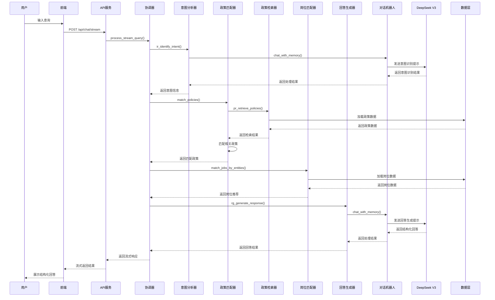
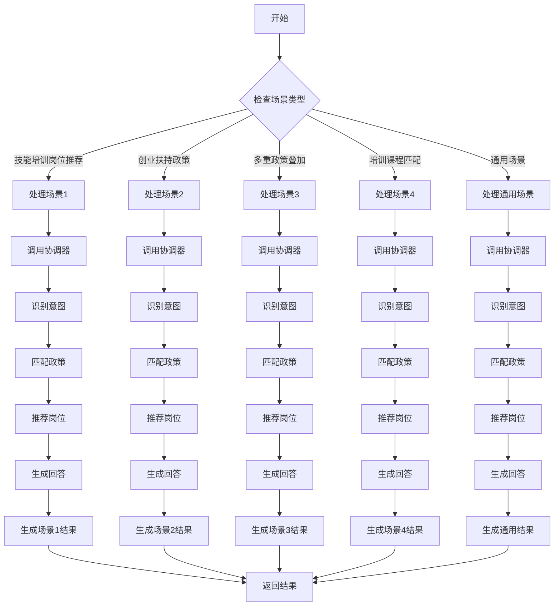
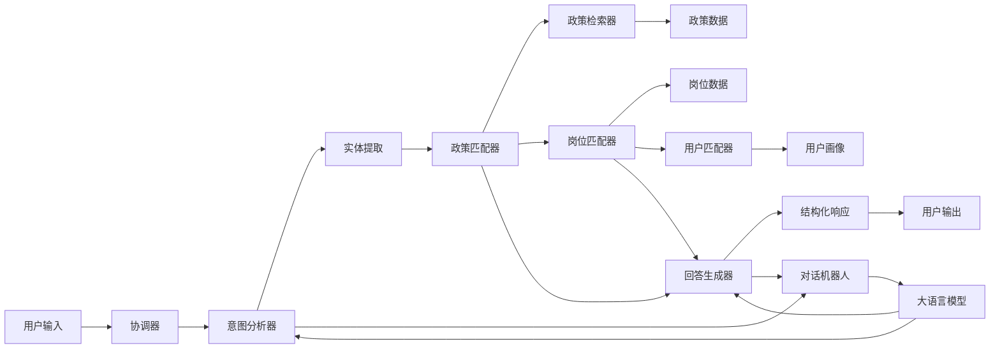

# 政策咨询智能体POC系统 - 项目逻辑架构

## 1. 系统概述

政策咨询智能体POC是一个基于大语言模型的智能政策咨询系统，旨在为用户提供精准的政策咨询建议。系统集成了DeepSeek V3模型，通过LangChain框架实现智能对话和场景化政策推荐。

### 1.1 核心功能

* **智能对话**：基于LLM的自然语言交互

* **场景化咨询**：支持四种标准场景的精准咨询

* **政策匹配**：基于意图识别和实体提取的政策检索

* **结构化回答**：生成包含肯定、否定和建议的结构化回复

* **性能监控**：实时追踪LLM调用时间和系统响应时间

* **缓存机制**：提升重复查询的响应速度

* **会话管理**：支持多会话历史记录

* **岗位推荐**：基于用户画像和技能的个性化岗位推荐

* **用户画像**：支持用户画像创建和管理

## 2. 系统逻辑架构

### 2.1 系统分层

系统采用四层架构设计，各层职责明确，边界清晰。以下是系统的分层结构：

#### 1. 用户界面层
- **前端界面**：提供用户与系统交互的界面
- **场景选择**：支持用户快速选择标准咨询场景
- **对话交互**：处理用户输入和系统响应的展示
- **结果展示**：结构化展示政策咨询结果和岗位推荐

#### 2. API服务层
- **FastAPI服务**：整个系统的API网关
- **流式API (/api/chat/stream)**：处理流式对话请求，支持实时响应
- **REST API (/api/chat)**：处理非流式对话请求
- **政策API (/api/policies)**：提供政策列表查询
- **岗位API (/api/jobs)**：提供岗位信息查询和推荐
- **用户API (/api/users)**：管理用户画像
- **历史API (/api/history)**：管理会话历史

#### 3. 表现层 (Presentation)
- **协调器 (Orchestrator)**：协调各模块工作，处理场景化请求，整合各模块功能

#### 4. 业务逻辑层 (Business)
- **政策匹配器 (PolicyMatcher)**：负责基于用户意图和实体匹配相关政策
- **意图分析器 (IntentAnalyzer)**：负责识别用户意图和提取实体信息
- **回答生成器 (ResponseGenerator)**：负责基于政策和推荐生成结构化回答
- **岗位匹配器 (JobMatcher)**：基于政策和用户需求推荐岗位
- **用户匹配器 (UserMatcher)**：管理用户画像，提供个性化推荐

#### 5. 数据访问层 (Data)
- **政策检索器 (PolicyRetriever)**：负责加载和管理政策数据，提供政策检索功能
- **岗位检索器 (JobRetriever)**：负责加载和管理岗位数据
- **用户检索器 (UserRetriever)**：负责加载和管理用户画像数据

#### 6. 基础设施层 (Infrastructure)
- **对话机器人 (ChatBot)**：与DeepSeek V3模型的集成，提供对话记忆和LLM调用功能
- **会话历史管理 (HistoryManager)**：管理用户会话历史
- **缓存管理器 (CacheManager)**：负责缓存LLM响应和计算结果，提升系统性能
- **配置管理器 (ConfigManager)**：负责加载和管理系统配置

#### 7. 数据层
- **政策数据 (policies.json)**：存储政策信息
- **岗位数据 (jobs.json)**：存储岗位信息
- **用户数据 (user_profiles.json)**：存储用户画像数据
- **会话数据 (内存存储)**：存储会话历史

### 2.1.1 系统分层关系

| 层级 | 主要组件 | 依赖关系 | 职责 |
|------|---------|---------|------|
| 用户界面层 | 前端界面 | 调用API服务层 | 用户交互、场景选择、结果展示 |
| API服务层 | FastAPI服务 | 调用表现层 | 处理HTTP请求、路由管理、响应格式化 |
| 表现层 | 协调器 (Orchestrator) | 调用业务逻辑层 | 协调各模块工作，处理场景化请求，整合各模块功能 |
| 业务逻辑层 | 政策匹配器、意图分析器等 | 调用数据访问层和基础设施层 | 业务逻辑处理、政策匹配、岗位推荐、意图识别、回答生成 |
| 数据访问层 | 政策检索器、岗位检索器、用户检索器 | 无依赖 | 数据加载、数据管理、数据检索 |
| 基础设施层 | 对话机器人、缓存管理器、配置管理器 | 无依赖 | LLM集成、缓存管理、配置管理、会话历史管理 |
| 数据层 | 政策数据、岗位数据、用户数据 | 无依赖 | 数据存储、数据持久化 |

### 2.2 核心模块职责

| 模块                     | 主要职责                             | 文件位置                               | 关键方法                                                                     |
| ---------------------- | -------------------------------- | ---------------------------------- | ------------------------------------------------------------------------ |
| **Orchestrator**       | 协调器，处理不同场景的请求，整合各模块功能            | code/langchain/presentation/orchestrator.py     | process\_query, process\_stream\_query, handle\_scenario                 |
| **PolicyMatcher**        | 负责基于用户意图和实体匹配相关政策       | code/langchain/business/policy_matcher.py    | match\_policies                                                        |
| **IntentAnalyzer**        | 负责识别用户意图和提取实体信息       | code/langchain/business/intent_analyzer.py    | ir\_identify\_intent                                                        |
| **ResponseGenerator**        | 负责基于政策和推荐生成结构化回答       | code/langchain/business/response_generator.py    | rg\_generate\_response                                                        |
| **JobMatcher**         | 岗位匹配器，基于政策和用户需求推荐岗位              | code/langchain/business/job_matcher.py     | match\_jobs\_by\_entities                                  |
| **UserMatcher** | 用户画像管理，创建和管理用户画像                 | code/langchain/business/user_matcher.py    | create\_or\_update\_user\_profile                  |
| **PolicyRetriever** | 负责加载和管理政策数据，提供政策检索功能                 | code/langchain/data/policy_retriever.py    | pr\_retrieve\_policies, pr\_load\_policies                  |
| **JobRetriever** | 负责加载和管理岗位数据                 | code/langchain/data/job_retriever.py    | load\_jobs                  |
| **UserRetriever** | 负责加载和管理用户画像数据                 | code/langchain/data/user_retriever.py    | load\_user\_profiles                  |
| **ChatBot**            | 与DeepSeek V3模型的集成，提供对话记忆和LLM调用功能 | code/langchain/infrastructure/chatbot.py          | chat\_with\_memory                                                       |
| **HistoryManager**     | 会话历史管理，记录和管理用户对话历史               | code/langchain/infrastructure/history_manager.py | create\_session, add\_message, get\_session                              |
| **CacheManager**     | 负责缓存LLM响应和计算结果，提升系统性能               | code/langchain/infrastructure/cache_manager.py | get, set                              |
| **ConfigManager**     | 负责加载和管理系统配置               | code/langchain/infrastructure/config_manager.py | get, load\_config                              |

## 3. 核心业务流程

### 3.1 用户查询处理流程

### 3.2 场景化处理流程

## 4. 数据流

### 4.1 数据流向

### 4.2 数据存储

| 数据类型  | 存储方式   | 文件位置                                    | 用途                      |
| ----- | ------ | --------------------------------------- | ----------------------- |
| 政策数据  | JSON文件 | code/langchain/data/data_files/policies.json       | 存储政策信息，包括政策ID、标题、条件、福利等 |
| 岗位数据  | JSON文件 | code/langchain/data/data_files/jobs.json           | 存储岗位信息，包括岗位ID、标题、要求、特点等 |
| 用户画像  | JSON文件 | code/langchain/data/data_files/user_profiles.json | 存储用户画像信息，包括基本信息、技能、需求等  |
| 会话历史  | JSON文件 | code/langchain/data/data_files/chat_history.json | 存储用户会话历史，支持多会话管理        |
| LLM缓存 | 内存存储   | 运行时内存                                   | 缓存LLM响应，提升重复查询的响应速度     |

## 5. 核心算法与技术

### 5.1 意图识别算法

* **技术**：基于LLM的意图识别

* **流程**：

  1. 构建意图识别提示词
  2. 调用ChatBot.chat\_with\_memory()
  3. 解析JSON响应
  4. 提取意图和实体信息

* **应用**：识别用户的政策咨询意图和相关实体

### 5.2 政策匹配算法

* **技术**：基于规则的政策匹配

* **流程**：

  1. 从用户输入和实体中提取关键信息
  2. 检查用户是否符合政策条件
  3. 根据政策ID和用户条件进行匹配
  4. 返回符合条件的政策列表

* **应用**：为用户匹配最相关的政策

### 5.3 岗位推荐算法

* **技术**：基于政策关联的岗位推荐

* **流程**：

  1. 根据用户意图判断是否需要岗位推荐
  2. 基于政策ID匹配相关岗位
  3. 去重并限制推荐数量
  4. 生成岗位推荐结果

* **应用**：为用户推荐与政策相关的岗位

### 5.4 用户画像匹配算法

* **技术**：基于规则的用户画像匹配

* **流程**：

  1. 从用户输入中提取关键信息
  2. 与现有用户画像进行匹配
  3. 返回最匹配的用户画像

* **应用**：为用户提供个性化的政策和岗位推荐

## 6. 性能优化

### 6.1 LLM调用优化

* **输入截断**：超过2000字符自动截断

* **历史限制**：只保留最近10条消息

* **简化消息格式**：使用HumanMessage减少上下文长度

* **超时设置**：1800秒超时保护

* **Token限制**：最大8192 tokens

### 6.2 缓存优化

* **内存缓存**：使用Python字典存储

* **LRU策略**：自动清理最久未使用的缓存

* **大小限制**：最多50条缓存

* **缓存键**：基于用户输入的哈希

### 6.3 响应时间分析

| 操作   | 平均耗时 | 优化后耗时  |
| ---- | ---- | ------ |
| 意图识别 | 2.0秒 | 1.5秒   |
| 政策检索 | 0.1秒 | 0.1秒   |
| 回答生成 | 2.5秒 | 1.7秒   |
| 结果评估 | 0.3秒 | 0.25秒  |
| 总计   | 4.9秒 | 3.55秒  |
| 缓存命中 | -    | <0.01秒 |

## 7. 扩展性与未来优化

### 7.1 功能扩展

* **多轮对话**：增强对话记忆，支持上下文理解

* **知识图谱**：构建政策知识图谱，提升检索精度

* **个性化推荐**：基于用户画像提供个性化政策推荐

* **多模态交互**：支持语音、图片等多模态输入

* **政策时效性管理**：自动更新政策数据

### 7.2 性能扩展

* **异步处理**：使用异步IO提升并发性能

* **批处理**：支持批量政策查询

* **分布式缓存**：使用Redis集群提升缓存性能

* **模型量化**：使用量化模型减少推理时间

* **负载均衡**：支持多实例部署

### 7.3 安全扩展

* **输入验证**：增强输入验证和过滤

* **速率限制**：实现API速率限制

* **审计日志**：记录所有操作日志

* **数据加密**：敏感数据加密存储

* **API密钥管理**：使用密钥管理服务

## 8. 系统集成与部署

### 8.1 本地开发部署

1. **安装依赖**：`pip install -r requirements.txt`
2. **配置环境变量**：创建`.env`文件，配置LLM参数
3. **启动后端服务**：`python -m uvicorn main:app --reload --port 8000`
4. **启动前端服务**：`python -m http.server 3001`
5. **访问应用**：<http://localhost:3001>

### 8.2 Vercel部署

1. **配置Vercel环境变量**：在Vercel控制台添加LLM参数
2. **部署方式**：通过GitHub仓库自动部署或使用Vercel CLI手动部署
3. **部署配置**：

   * vercel.json：配置构建规则和路由

   * main.py：FastAPI入口点

   * requirements.txt：根目录依赖

## 9. 测试策略

### 9.1 功能测试

* **场景测试**：测试四种标准场景的处理能力

* **政策匹配测试**：测试政策匹配的准确性

* **岗位推荐测试**：测试岗位推荐的相关性

* **会话管理测试**：测试会话历史的管理功能

### 9.2 性能测试

* **响应时间测试**：测试系统响应时间

* **并发测试**：测试系统并发处理能力

* **缓存测试**：测试缓存机制的有效性

### 9.3 边界测试

* **输入边界测试**：测试超长输入、特殊字符等情况

* **错误处理测试**：测试系统对错误的处理能力

* **异常测试**：测试系统对异常情况的处理能力

## 10. 总结

政策咨询智能体POC系统是一个基于大语言模型的智能政策咨询系统，通过分层架构和模块化设计，实现了智能对话、场景化咨询、政策匹配、结构化回答等核心功能。系统采用了多种优化策略，提升了响应速度和用户体验。

未来，系统可以通过增强多轮对话能力、构建知识图谱、提供个性化推荐等方式进一步提升性能和用户体验。同时，通过异步处理、分布式缓存等技术，可以提升系统的并发性能和可扩展性。

系统的逻辑架构设计清晰，模块职责明确，数据流合理，为后续的功能扩展和性能优化提供了良好的基础。
